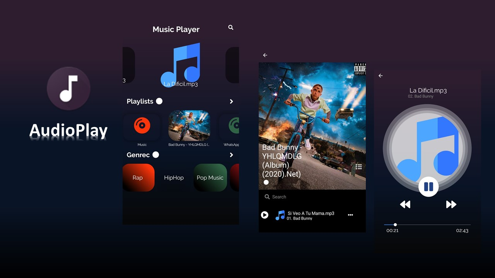

# AudioPlay
AudioPlay is music player that search for the files mp3 on your cell phone.
## Collaborators
-  [Rafael Fernandez](https://github.com/RafaelFernandez0512).
# Platforms
| iOS / Android| Xamarin.Forms |

  

# Features
- CarouselView.

- PancakeView.

- Plugin.MediaManager.Forms.

- Plugin.SharedTransitions.
